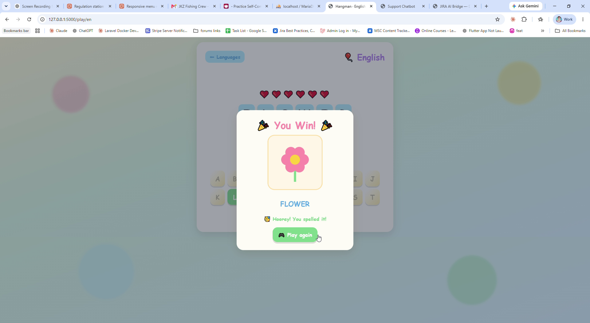

# 🎈 Hangman for Kids — Multilingual, Joyful, Offline

An elevated take on the classic **Hangman** game (CodeAlpha Task 1). It is
**versatile, multilingual, kid-friendly, and joyful** — shipping with **English**
and **Tamil** out of the box, auto-generated cute SVG illustrations, a colorful
terminal version, and a bright, fully responsive web UI with confetti
celebrations.

> Everything runs **100% offline** — no internet, no external assets. All
> artwork is generated programmatically as SVG.

---

## ✨ Vision & Features

| Pillar | What it means here |
| --- | --- |
| **Versatile & Multilingual** | Play in any language via simple JSON **language packs**. Ships with English + Tamil. Players can **upload their own packs** (file drop or web form) — packs are auto-discovered at runtime. |
| **Kid-friendly** | Only simple, curated easy words (animals, fruits, colors, common objects), each with a friendly hint. |
| **Images** | When a word is completed, a **cute auto-generated SVG** of that word appears, big and colorful. Words without a dedicated drawing fall back to a friendly emoji card. |
| **Joyful / Positive** | Bright, cheerful palette (sunny yellows, soft greens, sky blues, playful pinks), **confetti** on win, encouraging messages, gentle "good try" on loss — never harsh. |
| **Responsive** | The web UI works on phones, tablets, and desktops with an **on-screen tappable keyboard** and large touch targets. |

---

## 🎨 Design Decision: a Positive Theme (no gallows!)

Classic Hangman draws a stick figure being hanged — morbid and not suitable for
children. This project replaces it with a **"fill the rainbow / save the day"**
theme:

- Each **wrong guess fills in one band of a rainbow** and removes one ❤️ heart.
- There is **never a hanging figure**.
- Six wrong guesses still ends the round, but the message is gentle and
  encouraging ("Good try! Let's try a new word!").

This keeps the experience cheerful and age-appropriate while preserving the
classic 6-mistakes gameplay.

---

## 🔤 Design Decision: Tamil Cluster Guessing

English (and most alphabets) are guessed **one letter at a time**. Tamil is an
*abugida*: a written character is often a base consonant plus combining
vowel/virama marks (e.g. `பூ`, `னை`). Guessing raw Unicode code points would be
confusing for a child.

So for Tamil the game guesses at the **grapheme-cluster level**:

- `tokenize("பூனை", "ta")` → `["பூ", "னை"]` (2 readable characters), not 4 code points.
- The on-screen keyboard for a Tamil round is built from the **clusters in the
  current word plus shuffled distractor clusters** drawn from other words in the
  pack (since a fixed "Tamil alphabet" keyboard would be impractically large).

This is implemented in `src/hangman/game.py` (`tokenize` / `_tamil_clusters`)
and the keyboard builders in `cli.py` / `web/app.py`.

---

## 🧩 Language Pack Format

A language pack is a small UTF-8 **JSON** file:

```json
{
  "language": "English",
  "code": "en",
  "direction": "ltr",
  "alphabet": ["A", "B", "C", "...", "Z"],
  "words": [
    { "word": "CAT", "hint": "A pet that says meow", "image": "cat" }
  ]
}
```

| Field | Required | Notes |
| --- | --- | --- |
| `language` | ✅ | Human-readable name shown in the picker. |
| `code` | ✅ | Short unique id (used in URLs and filenames). |
| `words` | ✅ | Non-empty list of word entries. |
| `words[].word` | ✅ | The word to guess. |
| `words[].hint` | optional | Friendly hint. |
| `words[].image` | optional | Illustration id (see `images.py`) shown on win. |
| `alphabet` | optional | Fixed on-screen keyboard tokens. **Omit** for scripts like Tamil — the keyboard is then built from word clusters + distractors. |
| `direction` | optional | `"ltr"` (default) or `"rtl"`. |

### Adding a language

1. **By file:** drop a `<code>.json` pack into
   `src/hangman/languages/` (built-in) or `src/hangman/languages/uploads/`
   (user packs). It is auto-discovered next time the app reads packs.
2. **By web form:** on the home page, expand **"➕ Add a new language pack"** and
   upload your `.json`. It is validated, saved to the uploads folder, and the
   picker reloads with your new language.

Invalid packs are rejected with a friendly message (and a single bad upload
never breaks the game — see `packs.discover_packs`).

---

## 🖼️ Auto-generated Illustrations

`src/hangman/images.py` exposes `svg_for(id_or_word) -> str`. It returns a cute,
hand-coded SVG for known ids (cat, dog, fish, apple, banana, sun, star, ball,
tree, flower, house, car, bird, heart, moon, grapes, frog, duck, egg, milk, …).
Unknown ids fall back to a colorful card with a big emoji (or first letter). The
result always begins with `<svg`.

---

## 🚀 Install

```bash
# from the project root
python -m pip install -r requirements.txt
# optional: editable install so the `hangman` command is available
python -m pip install -e .
```

Python 3.10+ required.

---

## 🕹️ Run the CLI

```bash
python -m hangman
# or, after `pip install -e .`
hangman
```

A colorful terminal game: pick a language, guess letters/clusters, watch the
rainbow fill, and see emoji art when you win. Uses `colorama` for cross-platform
color (with a graceful plain-text fallback).

---

## 🌈 Run the Web App

```bash
python web/app.py
# then open http://127.0.0.1:5000
```

- **Home:** language picker + pack upload form.
- **Game:** big masked word, positive rainbow progress, tappable keyboard,
  hint button, confetti + SVG image on win, gentle encouragement on loss.

### JSON API

| Method | Path | Purpose |
| --- | --- | --- |
| `POST` | `/api/new` | Start a round: `{"code":"en"}` |
| `POST` | `/api/guess` | Guess a token: `{"token":"A"}` |
| `GET` | `/api/state` | Current round state |
| `POST` | `/api/upload-pack` | Upload a pack (file or JSON) |
| `GET` | `/api/image/<id>` | Serve a generated SVG |

---

## 🎬 Demo Video

A full walkthrough — pick a language, play rounds in English **and** Tamil, and
celebrate wins with confetti and picture rewards. Click the poster to play
[`docs/demo.mp4`](docs/demo.mp4):

[](docs/demo.mp4)

> On GitHub, drag-and-drop [`docs/demo.mp4`](docs/demo.mp4) into this section on
> github.com to get inline playback (paste the generated `user-attachments` link).

---

## 🖼️ Screenshots

### 🌈 Landing page (language picker)

The joyful welcome screen — choose **English** or **தமிழ் (Tamil)**, or upload
your own language pack.


### 🎮 Game in progress

The masked word, the positive **rainbow + hearts** progress (no gallows!), a hint,
and the large tappable on-screen keyboard.


### 🎉 Win screen

**"You Win!"** with **confetti** and the **auto-generated SVG picture reward** for
the word (here, a Tamil round — மரம் / *tree*).


### 🔤 Tamil round (syllable keyboard)

Tamil is guessed at the **grapheme-cluster (syllable)** level, so the keyboard is
built from clusters — e.g. `ம்`, `ரி`, `வா` — not a fixed alphabet.


---

## 🧪 Testing

```bash
python -m pytest -q
```

Covers: English & Tamil tokenization (including clusters/virama), win/lose
logic, max wrong guesses, masked display, pack loading & validation, image
fallback returning valid SVG, and random word selection within a pack. No
network access required.

---

## 📁 Project Structure

```
hangman_game/
├── src/hangman/
│   ├── __init__.py        # __version__
│   ├── __main__.py        # python -m hangman
│   ├── game.py            # HangmanGame, tokenize, choose_word
│   ├── images.py          # svg_for(...) auto-generated SVGs
│   ├── packs.py           # discover / load / validate / upload packs
│   ├── cli.py             # colorful terminal game
│   └── languages/         # en.json, ta.json (+ uploads/)
├── web/
│   ├── app.py             # Flask app + JSON API
│   ├── templates/         # index.html, game.html
│   └── static/            # style.css, game.js
├── tests/                 # pytest suite
├── requirements.txt
├── pyproject.toml
└── README.md
```

---

## 📜 License

MIT.
