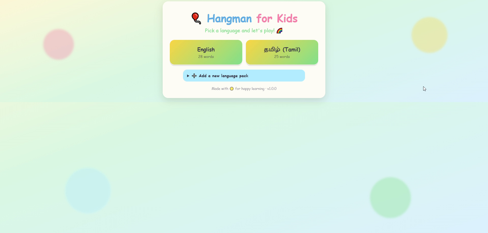
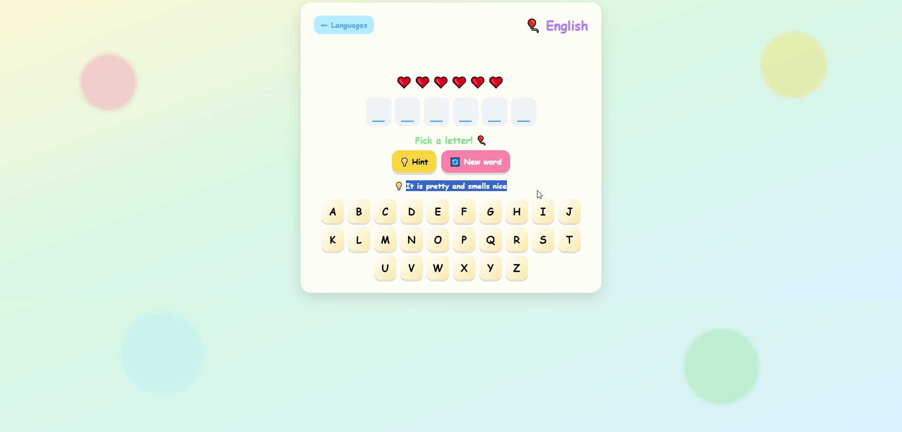
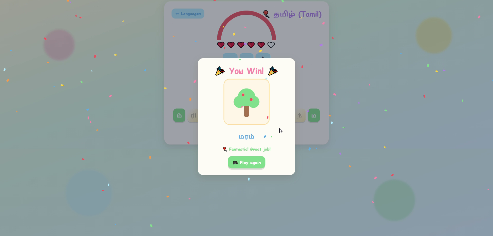
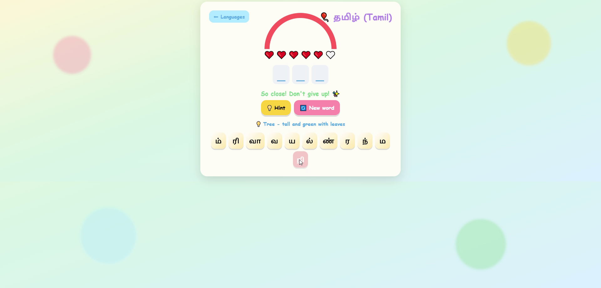

# 🎈 Hangman for Kids

A joyful, multilingual, fully-offline take on the classic **Hangman** game
(CodeAlpha Task 1) — English + Tamil, positive rainbow theme, emoji picture
rewards, a colorful CLI, and a responsive web UI with confetti.

> 📖 **Developer documentation** (architecture, install, run, API, design
> decisions, testing) lives in **[`docs/README.md`](docs/README.md)**.

---

## 📸 Screenshots

### 🌈 Landing page (language picker)

The joyful welcome screen — choose **English** or **தமிழ் (Tamil)**, or upload
your own language pack.



### 🎮 Game in progress

The masked word, the positive **rainbow + hearts** progress (no gallows!), a hint,
and the large tappable on-screen keyboard.



### 🎉 Win screen

**"You Win!"** with **confetti** and the **emoji picture reward** for the word
(here, a Tamil round — மரம் / *tree*).



### 🔤 Tamil round (syllable keyboard)

Tamil is guessed at the **grapheme-cluster (syllable)** level, so the keyboard is
built from clusters — e.g. `ம்`, `ரி`, `வா` — not a fixed alphabet.



---

## 📁 Project Structure

```
hangman_game/
├── src/hangman/
│   ├── __init__.py        # __version__
│   ├── __main__.py        # python -m hangman
│   ├── game.py            # HangmanGame, tokenize, choose_word
│   ├── images.py          # svg_for(...) emoji picture rewards
│   ├── packs.py           # discover / load / validate / upload packs
│   ├── cli.py             # colorful terminal game
│   └── languages/         # en.json, ta.json (+ uploads/)
├── web/
│   ├── app.py             # Flask app + JSON API
│   ├── templates/         # index.html, game.html
│   └── static/            # style.css, game.js
├── tests/                 # pytest suite
├── docs/                  # screenshots, demo video + developer docs
├── requirements.txt
├── pyproject.toml
└── README.md
```
